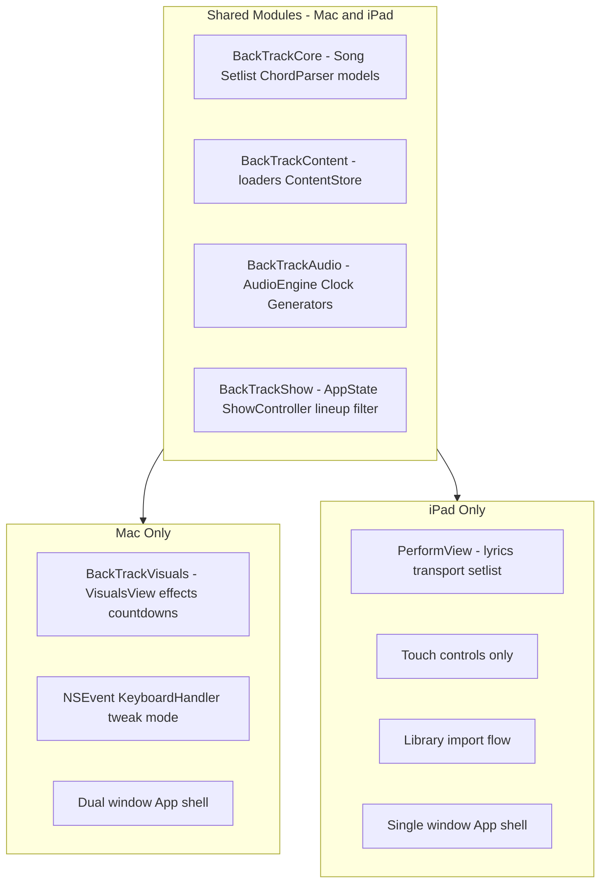

# BackTrack iPad — Performer App (v1 Plan)

## Decisions (locked in)

| Decision | Choice |
|----------|--------|
| **iPad scope** | Performer only — backing tracks + lyrics; no editing, no visuals, no interactives |
| **Setlists** | Same JSON as Mac; countdowns/interstitials/audience items silently skipped |
| **Content sync** | Copy-on-import from Mac; **full replace** on re-import (Update library wipes sandbox copy and re-copies) |
| **Import folders** | `Songs/`, `Setlists/`, `Samples/` only — skip Countdowns, Visuals, etc. |
| **Empty setlist UX** | Show message: "No songs in this setlist" (e.g. setlist is all countdowns/interstitials on iPad) |
| **Input** | **Touch only** — on-screen buttons; no Bluetooth keyboard support in v1 |
| **Minimum iPadOS** | **iPadOS 16+** — matches SwiftUI/API level used by Mac target; widest device support with least friction |
| **Repository** | **One GitHub repo** — shared SPM modules + Mac and iPad app shells |
| **iPad deployment** | **Apple Developer Program ($99/year)** — renew expired membership before Phase 1; TestFlight; **no App Store listing** |
| **Implementation order** | Phase 0a tests → Phase 0b shared modules → Phase 1 iPad app → Phase 2 polish |

---

## Product definition

**BackTrack iPad v1 is a lightweight, read-only performer.** You bring an iPad Mini, guitar, and sound system — no laptop, no TV, no projector.

| In scope (iPad v1) | Out of scope (desktop only) |
|--------------------|----------------------------|
| Backing track playback (drums, pads, bass) | JSON / song editing, tweak mode |
| Lyrics + chord/part readout | Visuals window, visualizers, post-effects |
| Setlist navigation (same files as Mac) | Countdowns, interstitials, audience interactives |
| All-songs mode (no setlist) | Hot-reload while editing on disk |
| Library import from Mac | Physical audience buttons |

**Practice and live use are the same app:** pop open the iPad, pick a setlist (or browse all songs), play.

Editing, visuals, and interactives stay on desktop. The iPad is a runtime device.

---

## Core principle: same setlists, graceful skip

Desktop setlists can mix four item kinds ([`SetlistItemRef`](../Sources/BackTrack/Setlist.swift)):

```swift
enum SetlistItemRef {
    case song(name: String)
    case countdown(name: String)
    case interstitial(name: String)
    case audienceInteractive(name: String)
}
```

**iPad loads the identical JSON** and resolves the same inventory. At lineup-build time, iPad applies a **perform-only filter**:

- **Songs** → included in navigable lineup, play normally
- **Countdowns / interstitials / audience interactives** → skipped silently (not shown, not played, not errored)

Setlist order among *songs* is preserved. Example:

```
Desktop setlist:  [Opener countdown] → [Song A] → [Interstitial] → [Song B] → [Lottery interactive]
iPad lineup:      [Song A] → [Song B]
```

Auto-advance at end of a song jumps to the next **song** in the setlist, skipping any unsupported items in between. No error dialogs — the performer never needs to know those items exist on the full show build.

Unresolved song refs still surface in a `SONG ISSUES` block (same as Mac), so a typo doesn't fail silently.

---

## Simplest sync: copy-on-import

No live sync, no hot-reload, no editing on iPad. **Simplest approach:**

1. Author everything on Mac under `~/BackTrack/` as today.
2. Before a show or practice session, **import the library once** into the iPad app:
   - Files app picker, AirDrop, or share a `BackTrack` folder
   - App copies `Songs/`, `Setlists/`, and `Samples/` into its sandbox (`Documents/BackTrack/`)
3. App loads at launch. **Re-import** when Mac content changes (one tap — "Update library") — **full replace**: deletes existing sandbox copy and re-copies the whole folder. Simple, no merge conflicts.

Why this over iCloud auto-sync:
- No sandbox bookmark complexity, no conflict resolution, no background file watching
- Matches "prep before the gig" workflow
- iPad doesn't need to know about `~/BackTrack/` paths at all — just its local copy

Optional later: watch an iCloud Drive folder. Not v1.

---

## What you carry to a show

```
Before:  MacBook + cables + maybe TV/projector + audio interface
After:   iPad Mini + guitar + sound system (USB audio or direct out)
```

The iPad shows lyrics and performance info while the backing track plays through the house system. No second screen needed because **there are no audience visuals in v1**.

---

## Architecture: shared package, thin iPad shell



### Module split

| Module | Contents | Targets |
|--------|----------|---------|
| **BackTrackCore** | `Song`, `Setlist`, `ChordParser`, `Countdown`, `Interstitial`, `AudienceInteractive` models | Mac + iPad |
| **BackTrackContent** | All loaders + `ContentStore` protocol | Mac + iPad |
| **BackTrackAudio** | `AudioEngine`, `Clock`, `Generators` | Mac + iPad |
| **BackTrackShow** | `AppState`, `ShowController` (extracted from `KeyboardHandler`), `PlatformCapabilities` | Mac + iPad |
| **BackTrackVisuals** | `VisualsView`, post-effects, countdown/interstitial/audience views | Mac only |
| **BackTrackMac** | `App.swift`, `ContentView`, `KeyboardHandler`, tweak mode | Mac only |
| **BackTrackPad** | `PerformView`, import UI, touch input | iPad only |

Mac keeps all existing behavior unchanged. iPad links only shared modules + its thin shell.

---

## Shared codebase estimate

~11,300 total LOC today. With visuals excluded from iPad:

| Layer | LOC | iPad |
|-------|-----|------|
| Models + loaders | ~2,500 | **Shared** |
| AudioEngine + Clock + Generators | ~2,050 | **Shared** |
| AppState + show logic | ~1,650 | **Shared** (with capability flag) |
| Visuals stack | ~3,500 | **Mac only** |
| KeyboardHandler | ~1,242 | **Mac only** (extract ~600 LOC actions → ShowController) |
| ContentView HUD | ~856 | **Mac only** (iPad gets new ~300 LOC PerformView) |
| AppKit bridges | ~400 | **Mac only** |
| Tweak mode | ~372 | **Mac only** |

**~5,000–5,500 lines shared directly; ~600 lines extracted from KeyboardHandler into ShowController.** iPad adds ~400–600 lines new (UI + import). Visuals (~3,500 LOC) never ships on iPad.

This is a **smaller, faster port** than the previous full-show concept.

---

## iPad UI (PerformView)

Single landscape window, touch-first, monospace terminal aesthetic matching Mac HUD spirit:

**Primary (right / center):** current part lyrics, large and scrollable

**Secondary (left or top bar):**
- Song name, key, BPM, current chord
- Bar/beat position, part name
- Transport: play/stop, prev/next song, prev/next part, loop
- Active setlist name + picker (cycle setlists, same as `D` key on Mac)
- `SONG ISSUES` if any

**No:** tweak mode, visuals toggle, countdown UI, telemetry, video/GIF, editing controls, keyboard shortcuts

**Input:** on-screen transport and navigation buttons only — no Bluetooth keyboard support in v1.

Designed for **iPad Mini landscape** first; works on full-size iPad too.

---

## ShowController extraction

Today [`KeyboardHandler.swift`](../Sources/BackTrack/KeyboardHandler.swift) (1,242 lines) mixes input capture with show actions. Refactor:

```
ShowController (shared)
├── start/stop transport
├── next/previous lineup item (respects platform filter)
├── next/previous part
├── toggle loop
├── cycle setlist
└── auto-advance on song end (skip unsupported items)

Mac: KeyboardHandler → calls ShowController via NSEvent
iPad: PerformView buttons → calls ShowController via touch
```

Audience-interactive logic, tweak mode, visuals toggling, and countdown state machines stay in Mac's `KeyboardHandler` — not extracted.

---

## PlatformCapabilities

Small enum passed into `rebuildLineup()` and auto-advance:

```swift
enum PlatformCapabilities {
    case full          // Mac — all lineup item kinds
    case performOnly   // iPad — songs only, skip rest
}
```

Same setlist JSON, same loaders, different lineup filter. No forked setlist format.

---

## Phased implementation

### Phase 0a — Golden-path tests (~3–5 days)

Add an XCTest target **before** refactoring, while the codebase is still a single module. Tests lock in behavior the Mac app already has and protect the shared-module split.

**Priority test coverage (pure logic, no AppKit/audio hardware):**

| Area | What to test |
|------|--------------|
| `ChordParser` | Parse progressions, sharps/flats, edge cases |
| Song loading | Valid JSON → `Song`; malformed JSON → issues with line refs |
| Setlist loading | Mixed item kinds resolve correctly |
| Lineup build | Active setlist → ordered `LineupItem` array; missing refs → issues |
| Perform-only filter | Same setlist → songs-only lineup, order preserved |
| Part navigation | Next/prev part wraps correctly within song structure |

**Fixture approach:** small JSON files in `Tests/Fixtures/` mirroring real `~/BackTrack/` shapes.

**Not in Phase 0a:** audio engine integration tests, UI tests, visuals. Those need hardware/simulator and come later if at all.

Run via `swift test` once the test target exists.

### Phase 0b — Shared modules, Mac unchanged (~1 week)

With tests green, refactor safely:

- Split SPM targets: Core, Content, Audio, Show, Visuals, Mac
- Introduce `ContentStore` (Mac impl: `~/BackTrack/`; iPad impl: sandbox copy)
- Extract `ShowController` from `KeyboardHandler`
- Add `PlatformCapabilities.performOnly` to lineup builder
- Verify Mac builds, `swift test` passes, manual smoke test unchanged

### Phase 1 — iPad performer MVP (~1–2 weeks)

- Add `BackTrack.xcodeproj` with iPad app target (**iPadOS 16+**) + Apple Developer signing
- Register iPad device; configure bundle ID and provisioning profile
- iPad app target in same repo (`Sources/BackTrackPad/`)
- Copy-on-import: pick folder → copy Songs/Setlists/Samples → bootstrap
- `PerformView`: lyrics, chords, transport, setlist picker
- Audio playback through iPad output (headphones / USB interface)
- First deploy to iPad via Xcode; set up **TestFlight** for wireless updates (solo tester — no public release)

### Phase 2 — Polish (~1 week)

- "Update library" re-import flow (full replace)
- TestFlight build for gig-ready install (1-year cert, no weekly Mac tether)
- iPad Mini live + practice testing (battery, audio latency, layout)
- Empty / all-non-song setlist: show **"No songs in this setlist"** message

**Total rough effort: ~4–5 weeks** (Phase 0a adds ~3–5 days but reduces refactor risk).

---

## iPad deployment (decided)

**Apple Developer Program — $99/year.** No App Store submission; personal performer use only.

### What this gives you

- **1-year signing certificates** — no 7-day expiry, no weekly Mac reconnect
- **TestFlight** — install and update on your iPad over the air; you can be the only tester
- **Direct install via Xcode** — USB deploy during development
- **Ad hoc** — register your iPad Mini as a device, install without TestFlight if preferred

### Workflow

1. **Renew** Apple Developer membership at [developer.apple.com](https://developer.apple.com) ($99/year) — account exists, membership expired; renew before Phase 1 device deploy
2. In Xcode: sign in with developer account, create App ID + provisioning for BackTrack iPad target
3. **While building:** Run to iPad from Xcode (USB)
4. **For gig use:** Upload build to TestFlight → install on iPad → push updates when songs/UI change

No public App Store listing required. No sideloading (SideStore) or free-tier 7-day cert workarounds.

### Not using

- Free Apple ID-only provisioning (7-day expiry — rejected for gig use)
- SideStore / LiveContainer sideloading
- App Store public release (unless you change scope later)

---

## Repository structure (decided: one repo)

**Single GitHub repo** for Mac desktop app, shared modules, iPad app, tests, and fixtures.

- Shared Swift modules in one `Package.swift`
- Mac and iPad change together when song schema or loaders evolve
- One CI run (`swift test`), one issue tracker, one history

Target layout after Phase 0b:

```
├── Package.swift              # shared modules + Mac executable
├── Sources/
│   ├── BackTrackCore/
│   ├── BackTrackContent/
│   ├── BackTrackAudio/
│   ├── BackTrackShow/
│   ├── BackTrackVisuals/      # Mac only
│   ├── BackTrackMac/          # Mac app shell
│   └── BackTrackPad/          # iPad app shell (Phase 1)
├── Tests/
│   └── BackTrackTests/        # golden-path unit tests
└── BackTrack.xcodeproj        # iPad target + Apple Developer signing (Phase 1)
```

SwiftPM handles shared modules; **`BackTrack.xcodeproj`** wraps the iPad app target for code signing, device deploy, and TestFlight uploads. Mac can continue via `swift run` or an Xcode Mac target — both in the same repo.

---

## What "just works" means in practice

| Desktop feature in setlist/song JSON | iPad behavior |
|--------------------------------------|---------------|
| Song with parts, chords, lyrics | Plays and displays fully |
| `visuals`, `videoClip`, post-effect fields on parts | Ignored (no rendering) |
| Countdown item in setlist | Skipped in lineup |
| Interstitial item in setlist | Skipped in lineup |
| Audience-interactive item in setlist | Skipped in lineup |
| Tweak-mode-editable fields | Read-only; edit on Mac, re-import |
| Multiple setlists | Same — cycle with picker |
| Drum patterns, pad/bass complexity | Fully supported (audio engine shared) |

---

## Future (explicitly not v1)

These can come later without changing the v1 architecture:

- HDMI / external display visuals (would reintroduce shared or iPad-specific visuals module)
- On-device setlist reordering (still not full editing)
- iCloud auto-sync instead of manual re-import
- Audience interactives on iPad with touch instead of physical buttons

v1 stays deliberately small: **perform with what you already authored on Mac.**

---

## Recommendation

**Yes — this scoped version is the right move.**

Dropping visuals, editing, and interactives from iPad v1 cuts the port roughly in half while delivering exactly what you described: grab the iPad, same setlists, backing tracks and lyrics, leave the laptop and TV at home.

The highest-value shared code is the audio engine and content model — which is also the hardest part to rewrite. The iPad shell is mostly a readable lyrics view and touch transport around code you already have.

**v1 definition of done:**
- Golden-path tests pass; Mac app behavior unchanged after module split
- Import a `BackTrack` library from Mac (copy-on-import; full replace on update)
- Load and cycle the same setlists; non-song items skipped silently
- Empty setlist shows "No songs in this setlist"
- Play songs with full backing track audio
- Display lyrics, chords, and part navigation via touch controls only
- No editing, no visuals, no interactives, no keyboard support on iPad
- Installed on iPad Mini via TestFlight (Apple Developer account renewed)
- All code in one GitHub repo
